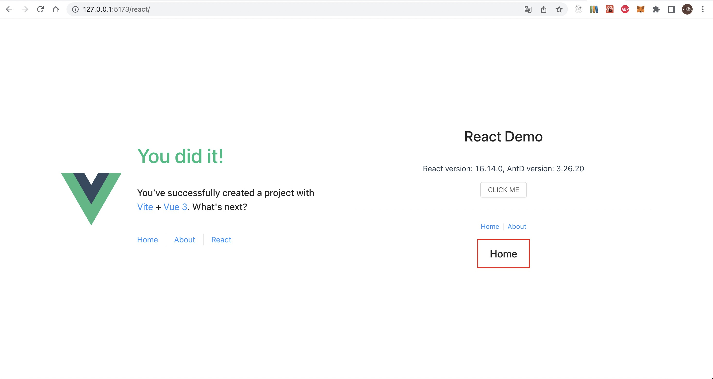

# 如何使用乾坤实现微前端架构（附 vue + react 演示）

> 本文介绍乾坤微前端框架，该框架可将多个前端应用整合为一个整体。每个子应用可以使用不同的技术栈，相互独立开发和部署，同时共享一些公共资源和状态。本文演示如何使用乾坤来实现微前端架构，主应用为 vue，子应用为 react。

## 什么是乾坤

乾坤是一种微前端框架，可以将多个前端应用集成为一个整体。每个子应用可以使用不同的框架和技术栈，它们之间可以相互独立开发和部署，也可以共享一些公共资源和状态。

乾坤提供了一套完整的生命周期函数和通信机制，可以让不同的子应用之间进行跨框架和跨域的通信和交互。它还提供了一些工具和插件，可以帮助开发者更好地管理和调试整个微前端系统。

使用乾坤可以使前端开发更加模块化、高效和可维护，同时提供更好的用户体验和性能。

## 为什么要使用乾坤

在实际的项目中，我们可能会有多个前端应用需要协同工作，例如一个电商系统包含了商品、订单、支付等多个子系统，每个子系统都有自己的团队和技术栈，但是它们需要共享一些公共的资源和状态，同时也需要在用户体验上保持一致性和流畅性。

乾坤可以很好地解决这个问题，它可以将多个子应用集成到一个主应用中，实现共享资源和状态，同时保持一致性和流畅性。值得注意的是，乾坤对主应用的技术栈是没有任何要求的。下面我们将用一个简单的实例展示，完成一个微应用要做的最小的改动。

## 主应用修改内容

在主应用中，我们需要引入乾坤的相关库和修改一些代码，以便注册和启动子应用。

主入口 packages/vue-project/src/main.ts

```diff
import { createApp } from 'vue'
import { createPinia } from 'pinia'
+ import { registerMicroApps, start } from 'qiankun';
import App from './App.vue'
import router from './router'

import './assets/main.css'

const app = createApp(App)

app.use(createPinia())
app.use(router)

app.mount('#app')

+ // 注册子应用
+ registerMicroApps([
+   {
+     name: 'react-app',
+     entry: '//localhost:7100',
+     container: '#subapp-container',
+     activeRule: '/react',
+   },
+ ])

+ // 启动 qiankun
+ start()
```

这段代码中，我们注册了一个名为 react-app 的子应用，它的入口地址是 //localhost:7100，容器选择器为 #subapp-container，路由匹配规则为 /react。在启动时，我们调用了 start 函数，开始加载和运行子应用。

在页面中，我们需要添加一个容器，以便渲染子应用的内容。容器的 ID 需要和注册时指定的容器选择器一致。

在 `packages/vue-project/src/App.vue` template 里面增加 

```html
  <div id="subapp-container"></div>
```

需要注意的是，id（subapp-container）需要和 registerMicroApps 上设置的 container 对应上。
也就是说你只需要把 `<div id="subapp-container"></div>` 放在你想要渲染子应用的地方即可。

## 子应用修改

### 注入 __webpack_public_path__

新建文件 public-path.js 在 index.js 中引入 `import './public-path';`

```js
if (window.__POWERED_BY_QIANKUN__) {
  // eslint-disable-next-line no-undef
  __webpack_public_path__ = window.__INJECTED_PUBLIC_PATH_BY_QIANKUN__;
}
```

### 乾坤生命周期

在使用乾坤时，需要将主应用和子应用分别开发和部署，然后在主应用中通过 registerMicroApps 注册子应用，并在 start 启动乾坤。子应用需要在 bootstrap 生命周期中做一些初始化工作，如加载依赖库等；在 mount 生命周期中渲染子应用；在 unmount 生命周期中卸载子应用。

`src/index.js`

```js
// 如果不是乾坤子应用环境，直接渲染
if (!window.__POWERED_BY_QIANKUN__) {
  render({});
}

// 导出乾坤需要的生命周期函数
export async function bootstrap() {
  console.log('[react] react app bootstraped');
}

export async function mount(props) {
  console.log('[react] props from main framework', props);
  render(props);
}

export async function unmount(props) {
  const { container } = props;
  ReactDOM.unmountComponentAtNode(container ? container.querySelector('#root') : document.querySelector('#root'));
}
```

### 处理子应用路由

如果你的子应用用到了 `react-router-dom`，如果是 `HashRouter` 理论上不需要处理，如果是 `BrowserRouter` 则需要动态设置 `basename`

```js
<Router basename={window.__POWERED_BY_QIANKUN__ ? '/react' : '/'}>
```

需要注意的是 basename 要和你在主应用中的 registerMicroApps 配置的 `activeRule: '/react',` 对应上。

到此，我们的乾坤示例就完成了。可以通过启动主应用和子应用来验证是否正常运行。



### 源码归档

[qiankun-vue-react-demo](https://github.com/xiaohuoni/qiankun-vue-react-demo)
